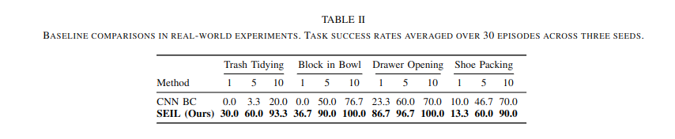

# Authors
Mingxi Jia, Dian Wang, Guanang Su, David Klee, Xupeng Zhu, Robin Walters, Robert Platt

# Abstract
In robotic manipulation, acquiring samples is extremely expensive because it often requires interacting with the real world.  Traditional image-level data augmentation has shown the potential to improve sample efficiency in various machine learning tasks. However, image-level data augmentation is insufficient for an imitation learning agent to learn good manipulation policies in a reasonable amount of demonstrations. We propose Simulation-augmented Equivariant Imitation Learning (SEIL), a method that combines a novel data augmentation strategy of supplementing expert trajectories with simulated transitions and an equivariant model that exploits the $\mathbf{O}(2)$ symmetry in robotic manipulation. Experimental evaluations demonstrate that our method can learn non-trivial manipulation tasks within ten demonstrations and outperforms the baselines with a significant margin.

# Approach
## 1. Equivariant Behavioral Cloning
  

## 2. Transition Simulation
  

# Results
* Simulation results
  
  <!--  -->
  
* Real-world results
 
  
# Experiments
## Real-world tasks
* Block in Bowl
  
* Trash Tidying
  
* Shoe Packing
  
* Drawer Opening
  

## Interactive close-loop behavior
* Interactive Drawers
  
* Interactive "Trash Tidying"
  

# Citation
```
@article{jia2022seil,
  title={SEIL: Simulation-augmented Equivariant Imitation Learning},
  author={Jia, Mingxi; Wang, Dian; Su, Guanang; Klee, David; Zhu, Xupeng; Walters, Robin; Platt, Robert},
  journal={arXiv preprint arXiv:2211.00194},
  year={2022}
}
```