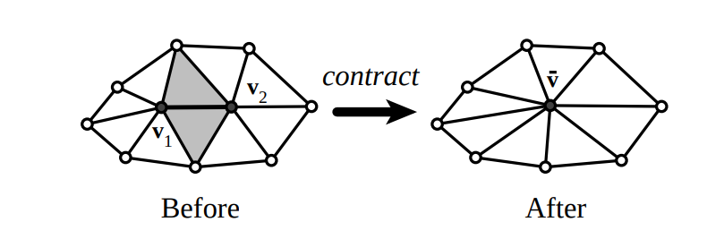

# Mesh Simplification
<!--  -->
3D object meshes often contains millions of redundant vertices and faces. This tool is based on ["Surface Simplification Using Quadric Error Metrics"](http://mgarland.org/files/papers/quadrics.pdf) , and it can help you to reduce points in your mesh model. Codes can be found [here](https://github.com/SaulBatman/Mesh_Simplify)

# MAYA 3D mesh modeling

The toolbos is based on Autodesk MAYA and Python, including tools such as skeleton manipulation, automatic disturbance, and batch outputting. Please refer to [this repository](https://github.com/SaulBatman/PCA-MAYA-tools).

# TurbineNet
* Coming soon!
